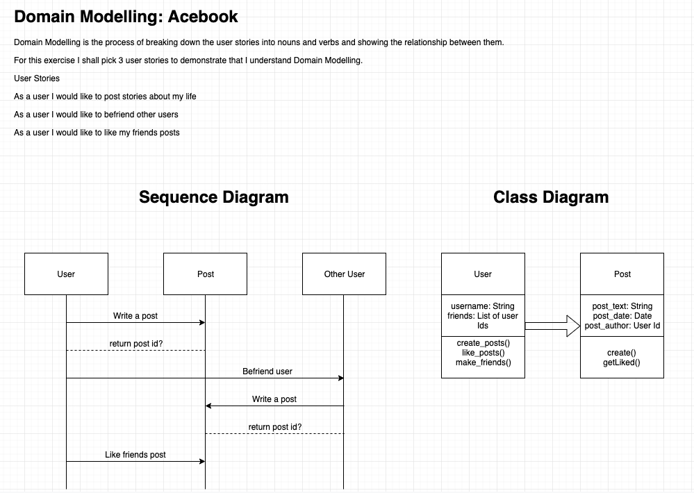

<h1 align="center">Ace Book: Team 404</h1>

    

[Challenge ](#challenge) |
[Installation ](#installation) |
[Testing ](#testing) |
[Contributions ](#contributions) |
[Deployment ](#deployment) |
[App ](#app) |
[Material ](#material)

## Challenge

The purpose of this project was two fold. The technical challenge is to reproduce the functionality of a social network, using Rails and CI. The additional challenge was to work in teams using Agile practices.

### Finished User Stories

When a user hasn't signed up and visits the index of the application:
- if they visit another URL, they are redirected to the index
- they can see a sign up page which prompts them to enter in their email address and password.
- they can only enter valid emails, otherwise they see helpful information to indicate why the email was not valid
- they can only enter passwords between 6-10 characters, otherwise they see helpful information to indicate why the password was not valid
- When they submit their details, they are logged in and redirected to their posts page with a message saying they were successful signing up

When a user hasn't signed in and visits the index of the application:
- if they visit another URL, they are redirected to the index
- they can see a link to a sign in page which prompts them to enter in their email address and password.
- they can only enter valid emails
- When they submit their details, they are logged in and redirected to their posts page.

A signed-in user can:
- update their own posts for a maximum of 10 mins after they're created.
- see a helpful error message if they try to update another user's post
- delete their own posts.
- see a helpful error message if they try to delete another user's post

Posts:
- appear with newest post first
- can have new lines in them
- show the date they were posted

## Outstanding User Stories

Signed in users can:
- Like other users' posts
- Send each other friend requests
- Accept friend requests
- Reject friend requests
- Chat with friends

## Our Domain Model

### The Technical Challenge

The challenge was to mirror the functionality of the popular social media site, Facebook.
We are using Ruby on Rails as the framework and programming language.

The project was to be written in Ruby using the Rails framework.

The applications involved in this development:
* Rails
* Rubocop Linter
* GitHub
* Devise
* Travis
* Heruko
* Materialize

#### [Rails](https://guides.rubyonrails.org/)
This is a framework for writing Ruby programs. Rails promotes the concept that models, views, and controllers should be kept separate by storing the code for each element as separate files in separate directories. Installing Rails sets up the directory structure and provides a number of modules that facilitate the Model View Controller model. `ActiveRecord` is the business logic and database communication. `ActionView` deals with the presentation of pages returned to the client. `ActionController` handles browser requests and communication between the model and the view.

#### [Rubocop Linter](https://rubocop.readthedocs.io/en/latest/)
To ensure that the code is clean and formatted properly we are using Rubocop. This will analyse the code and provide information about where the formatting is not correct.

#### [GitHub](http://www.github.com)
We are using GitHub as a development environment. This enables us to share the source code and work on different branches to ensure that there are no conflicts.

#### [Travis](https://travis-ci.org/)
Travis is a `Continuous Integration` tool. This enables us to integrate code into a shared repository several times a day. Each check-in is then verified by an automated build, allowing teams to detect problems early.

#### [Heruko](https://www.heroku.com/)
Heruko is a cloud based repository that enables working prototypes to be made available for client feedback. This facilitates the iterative development process, making us more agile and able to respond to client feedback quickly.

#### [Devise](https://github.com/plataformatec/devise)
This is a user authentication package. It provides all of the complex functionality of user login, validation and encryption. Using this has enabled us to avoid `reinventing the wheel`.

#### [Materialize](http://materialize.labs.my/)
This is a framework that speeds up the styling of the views in CSS by providing a library of tested functions that we bolt on.

### Agile Practices

The purpose of `Agile` practices is to make the development process more effective and more responsive to changes. There is a pattern of communication methods, planning and development cycles and interaction with the client that enables fast paced. Each morning we have a `Standup`, this is a quick meeting to go over where we are and what everyone plans to do today. At the end of the day we have a `Retro` which covers what we achieved, what problems we had and a rough plan for the next day. We have 2 day `Sprints` covering the planning and modelling in the first day and the coding once we have agreed on a model and plan. We regularly commit from separate branches and Travis carries out a comprehensive test using our test suites before committing a working, fully tested URL for the client to see and comment on.

## Installation
 - Clone this repository to your machine
 - `cd` to project root in console
 - `bundle install` in project root

## Testing
 - `rspec` in project root
 - `rubocop` in project root

## Contributions

See [CONTRIBUTING.md](CONTRIBUTING.md)

## Deployment
 - Continuous deployment and integration through Travis and Heroku

## App
https://obscure-ridge-98823.herokuapp.com/
